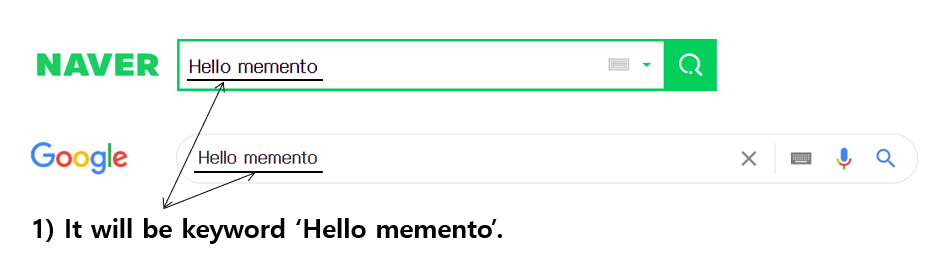
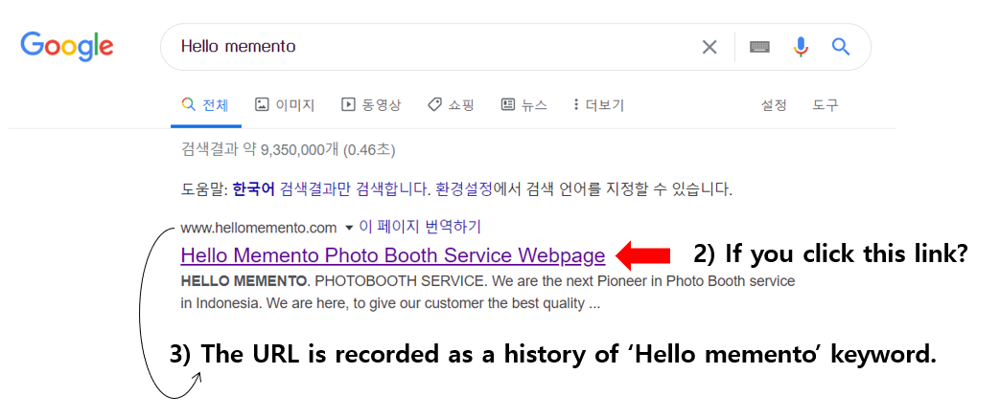
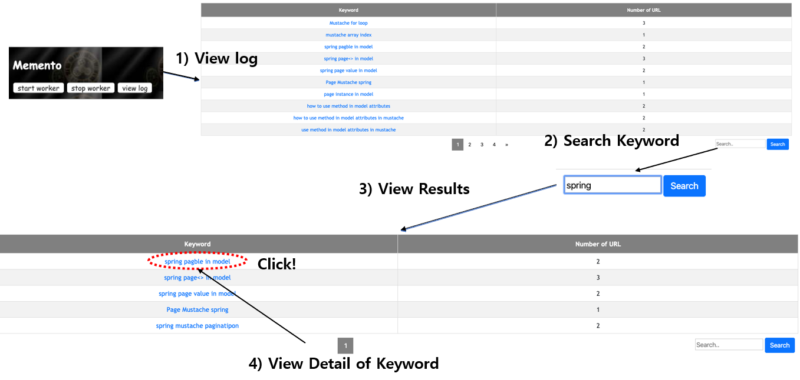
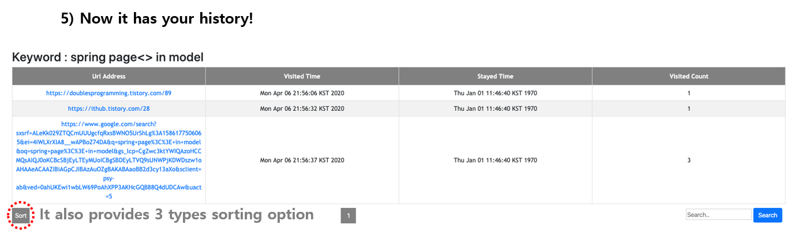
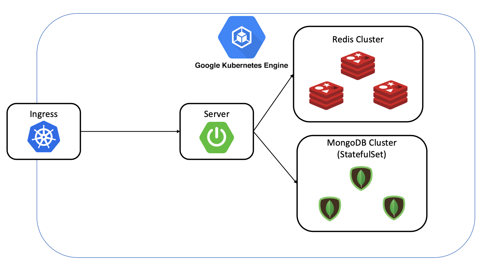

# Memento

### Introduction

> Application for tracking & searching own search hitstories in Google Chrome.

This simple extension tracks and stores searching word in during Google(or Naver) search process.
If you search something in google search form. The **Memento** Chrome extension catches the keyword. After that, it saves the URL of the sites you visited as a history of visits to that keyword.




#### Feature

1. Simple to use with chrome extension installation and turning on/off only.
2. The visit records can be inquired by keyword. This will help you find the sites you've visited before more easily.
3. The records can be arranged according to the time stayed, the number of visits, and the time visited.
4. Of course, keyword search functionality is supported within user log.

### Prerequisites

- Java 1.8+
- Spring Boot 2.2.5 +
- Gradle 6.0.1 +
- Spring Data MongoDB
- Spring Data Redis
- Mustache

#### Run Server

- Configuration for DB with docker (Mongo DB, Redis)

  ```
  docker-compose up -d
  ```

- Run 

  ```
  gradle bootRun
  ```


### How to use?

The application is the Chrome Extension to track browsing history using Google Chrome. It has the following services :

1.  Installation the Chrome Extension
2. Start worker to execute tracking the your search histories in background.
3. Click the  `View Log` to show the all of histories.
4. Search keywords containing the words entered.
5. Click the keyword for more information about the keyword.
6. Stop worker to stop tracking the your search histories in background.




### Archeitecture (To - do)



---
Ver:1.0